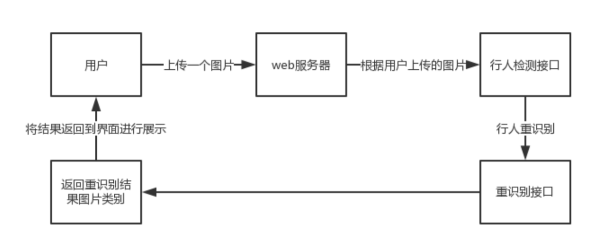
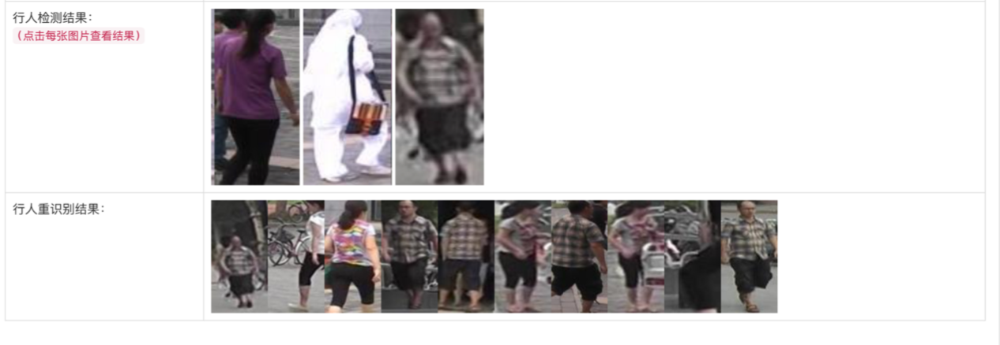

It is forked from [deep-person-reid](https://github.com/KaiyangZhou/deep-person-reid). Based on that, we updated model and integrated pedestrian detection.  

行人重识别是指给定一幅行人图像，在已有的可能来源于非重叠摄像机视域的图像或视频序列中,识别出目标行人。   

## 主要工作
1、集成了yolo3检测算法，能够从图形中检测出多个行人，然后进行搜索  
2、简单的前端页面  

## 环境依赖  
Anaconda3-5.3.1、Python 3.5、PyTorch 0.4.1，GPU GeForce GTX 1080   
依赖包：`pip install requirements.txt`

## 训练数据
由于训练资源有限，项目中使用的数据集是 Market-1501

## 模型训练 
1、使用Softmax cross-entropy loss 训练
```
python train_imgreid_xent.py -s market1501 -t market1501 --height 128 -- width 64 --optim adam --label-smooth --lr 0.003 --max-epoch 60 -- stepsize 20 40 --train-batch-size 128 --test-batch-size 128 -a resnet50 -- eval-freq 20 --save-dir log/market1501-xent
```
日志输出见log/market1501-xent/log_train.txt   

2、使用Softmax cross-entropy loss 和triplet loss进行训练
```
python train_imgreid_xent_htri.py -s market1501 -t market1501 --height 128 --width 64 --optim adam --label-smooth --lr 0.003 --max-epoch 60 - -stepsize 20 40 --train-batch-size 128 --test-batch-size 128 -a resnet50 - -eval-freq 20 --save-dir log/market1501-xent-htri
```

## 模型使用
使用infer.py脚本中Classify
```
from infer import Classify
classify = Classify(gallery_path='./data/market1501/bounding_box_test')
img_paths = glob.glob(osp.join('./data/market1501/images', '*.jpg'))
print(classify.infer(img_paths))
```

## 前端说明


直接使用`python app.py`,然后进入`http://localhost:8000`,上传要检测的图片，即可返回图片中的行人以及行人重识别的结果   


## 参考资料

- Market-1501:http://www.liangzheng.org/Project/project_reid.html
- Yolov3:https://github.com/ayooshkathuria/pytorch-yolo-v3
- https://github.com/KaiyangZhou/deep-person-reid
- [Revisiting Temporal Modeling for Video-based Person ReID](https://arxiv.org/abs/1805.02104)
- Person Re-identification Past Present and Future
- MARS- A Video Benchmark for Large-Scale Person Re-identification